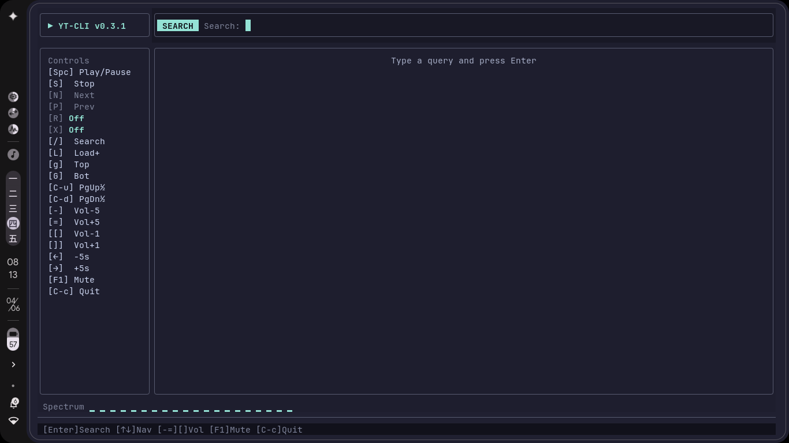
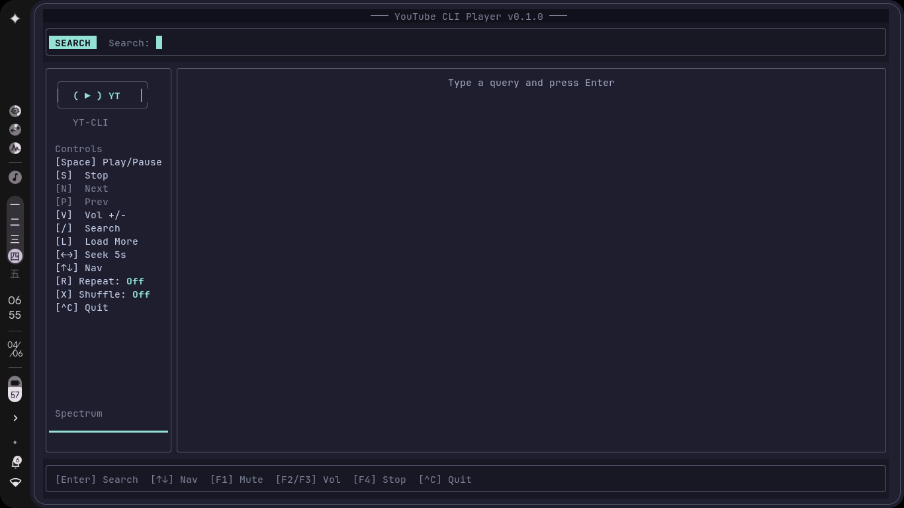

# rustyoutube-cli

> YouTube TUI client — search, play, visualizer. Dibangun dengan Rust 🦀

[](https://github.com/I-XXII-V/Youtube-Cli/actions/workflows/release.yml)

Terminal UI untuk mencari dan memutar audio YouTube via **mpv** + **yt-dlp**, dengan visualizer FFT real-time.



<details>
<summary>📸 Tampilan search</summary>


</details>

---

## ✨ Fitur

| Fitur | Keterangan |
|-------|-----------|
| 🔍 **Search** | Cari video YouTube langsung dari terminal (max ~50 results) |
| ▶️ **Play** | Putar audio via mpv (streaming, tanpa download) |
| 📋 **Playlist** | Next/Prev/Shuffle/Repeat (Off · All · One) |
| 🎚 **Volume** | `-` `=` atau F2/F3 (Fn+F2/F3 di ThinkPad), mute F1 |
| ⏪⏩ **Seek** | `←` `→` maju/mundur 5 detik |
| 📊 **Visualizer** | Spectrum 20 bar real-time dari FFT audio capture |
| 🎨 **Catppuccin Mocha** | Tema dark yang easy on the eyes |
| ⚙️ **Config file** | `~/.config/rustyoutube-cli/config.toml` |
| ⌨️ **Vim keys** | Navigasi pake j/k, PageUp/PageDown, Home/End |

## 🚀 Installasi

### Prerequisites

| Dependency | Debian/Ubuntu | Arch Linux | Fedora | macOS |
|-----------|--------------|------------|--------|-------|
| **mpv** | `sudo apt install mpv` | `sudo pacman -S mpv` | `sudo dnf install mpv` | `brew install mpv` |
| **yt-dlp** | `sudo apt install yt-dlp` | `sudo pacman -S yt-dlp` | `sudo dnf install yt-dlp` | `brew install yt-dlp` |

Atau install manual: [mpv.io](https://mpv.io/install/) · [yt-dlp](https://github.com/yt-dlp/yt-dlp#installation)

### Dari source (semua OS)

```bash
# Rust wajib terinstall — https://rustup.rs
git clone https://github.com/I-XXII-V/Youtube-Cli.git
cd Youtube-Cli/rustyoutube-cli
cargo build --release
sudo cp target/release/rustyoutube-cli /usr/local/bin/

# atau langsung cargo install
cargo install --path .
```

### Via binary release

Download binary dari [GitHub Releases](https://github.com/I-XXII-V/Youtube-Cli/releases) (tersedia untuk Linux, macOS, Windows):

```bash
# Contoh Linux
curl -OL https://github.com/I-XXII-V/Youtube-Cli/releases/latest/download/rustyoutube-cli-x86_64-unknown-linux-gnu.tar.gz
tar xzf rustyoutube-cli-*.tar.gz
sudo mv rustyoutube-cli /usr/local/bin/
```

## 🎮 Penggunaan

```bash
rustyoutube-cli

# Dengan opsi kustom
rustyoutube-cli --socket /tmp/mpv-socket --mpv-bin /usr/bin/mpv --ytdlp-bin /usr/bin/yt-dlp
```

### Keybindings

| Mode | Key | Aksi |
|------|-----|------|
| **Normal** | `Enter` / `Space` | Putar selected |
| | `j` / `k` `↑` `↓` | Navigasi |
| | `PgUp` `PgDn` | Scroll cepat |
| | `g` | Ke hasil pertama (vim `gg`) |
| | `G` | Ke hasil terakhir (vim `G`) |
| | `Ctrl+d` / `Ctrl+u` | Scroll setengah halaman |
| | `/` | Mode search |
| | `n` / `w` | Next lagu |
| | `p` / `b` | Prev lagu |
| | `s` | Stop |
| | `r` | Repeat (Off → All → One) |
| | `x` | Shuffle on/off |
| | `l` | Load more results |
| | `←` `→` | Seek ±5 detik |
| | `-` `=` | Volume ±5% (coarse) |
| | `[` `]` | Volume ±1% (fine) |
| | `F1` | Mute |
| | `F2` `F3` | Volume ±5% (Fn+F2/F3 di ThinkPad) |
| | `^C` | Quit |
| **Search** | `Enter` | Search |
| | `Esc` / `/` | Batal |

## ⚙️ Config

Lokasi: `~/.config/rustyoutube-cli/config.toml`

```toml
socket = "/tmp/rustyoutube-mpv.sock"
mpv_bin = "mpv"
ytdlp_bin = "yt-dlp"
default_volume = 50
```

## 🏗 Arsitektur

```
src/
├── main.rs        — Entry: clap CLI, config load, init services
├── app.rs         — State machine, event loop, keyboard dispatch
├── ui.rs          — ratatui draw (titlebar, searchbar, sidebar, content, statusbar)
├── model.rs       — Video, Track, Playlist, RepeatMode
├── config.rs      — Config file serde deserialize
├── ytdlp.rs       — yt-dlp subprocess (search, stream_url)
├── mpv.rs         — mpv Unix socket JSON-RPC control
└── visualizer.rs  — cpal + rustfft → 20 bar spectrum
```

### Stack

| Layer | Crate | Role |
|-------|-------|------|
| TUI | `ratatui` + `crossterm` | Terminal UI |
| Extraction | `yt-dlp` (subprocess) | Search + stream URL |
| Playback | `mpv` (Unix socket) | Audio decode/play |
| Visualizer | `cpal` + `rustfft` | FFT spectrum |
| CLI | `clap` | Argument parsing |
| Config | `toml` + `serde` | Config file |

## 🔧 Development

```bash
git clone https://github.com/I-XXII-V/Youtube-Cli.git
cd Youtube-Cli/rustyoutube-cli

# Build + run
cargo run --release

# Atau build dulu, jalanin langsung
cargo build --release
./target/release/rustyoutube-cli
```

### Code style

```bash
cargo clippy -- -D warnings
cargo fmt
```

## 📦 Release

Buat release baru dengan tag:

```bash
git tag v0.1.0
git push origin v0.1.0
```

GitHub Actions akan otomatis build binary untuk Linux, macOS, dan Windows, lalu upload ke Release.

## 📜 Lisensi

MIT — bebas pakai, bebas modifikasi, bebas sebar.

---

Dibuat dengan 🦀 + ☕ + 🎵 oleh [I-XXII-V](https://github.com/I-XXII-V)
